# Experiment 1
In this experiment we wish to explore what happens with the decision boundary depending on where the point to forget is positioned (for the synthetic data we call this the "rouge point"). We experiment with placing it in a wrong class, 


## Data generation
To generate the data, run:
```bash
python exp1/generate_data.py
```

## The network
The network is a simple feedforward network can be seend below:

## Experiment runs
Now we run the experiment on each of the dataset configuration, moving the rogue point.

### 1. Rogue point with same distance to all centroids (close to decision boundary)
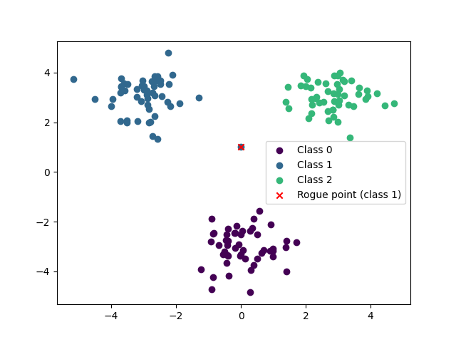

#### Expectation
We expect that unlearning this point will confuse the model and decision boundary will change more than for the other setups.

#### Run the experiment

Run the experiment
```bash
python exp1/experiment_run.py
```

#### Findings

<table>
  <tr>
    <th align="center" style="font-weight: bold"></th>
    <th align="center" style="font-weight: bold">Original</th>
    <th align="center" style="font-weight: bold">Unlearned</th>
  </tr>
  <tr>
    <td>Retrain</td>
    <td></td>
    <td>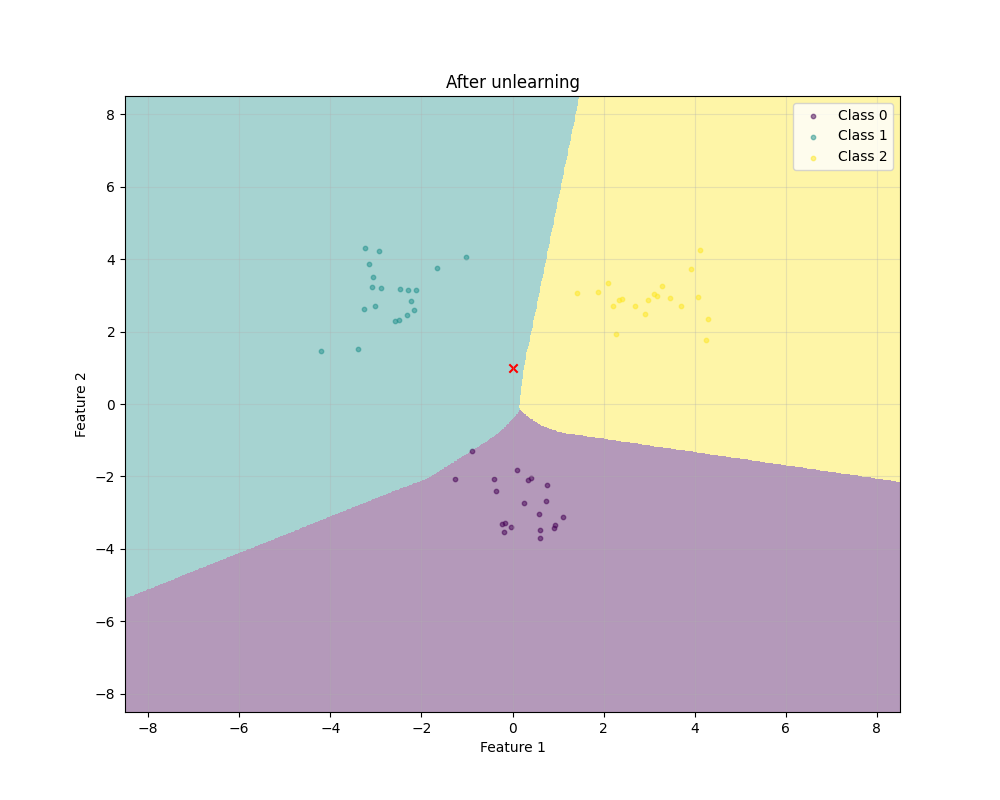</td>
  </tr>
</table>

### 2. Rogue point with same centroid as its class
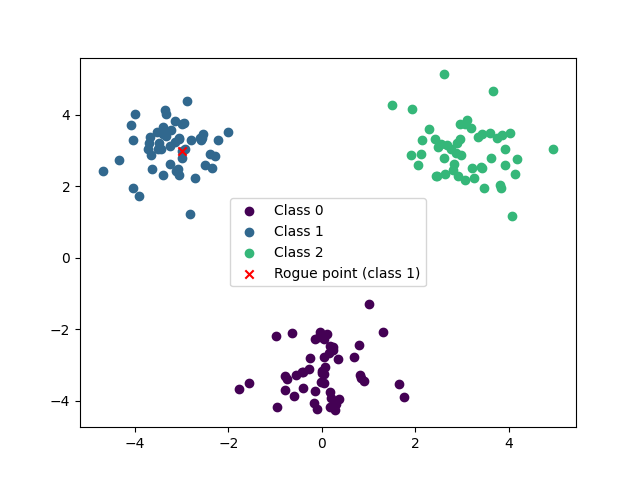

#### Expectation
<!-- TODO: What do we expect -->


#### Run the experiment
<!-- TODO: Command to run experiment -->


#### Findings

<table>
  <tr>
    <th align="center" style="font-weight: bold"></th>
    <th align="center" style="font-weight: bold">Original</th>
    <th align="center" style="font-weight: bold">Unlearned</th>
  </tr>
  <tr>
    <td>Retrain</td>
    <td>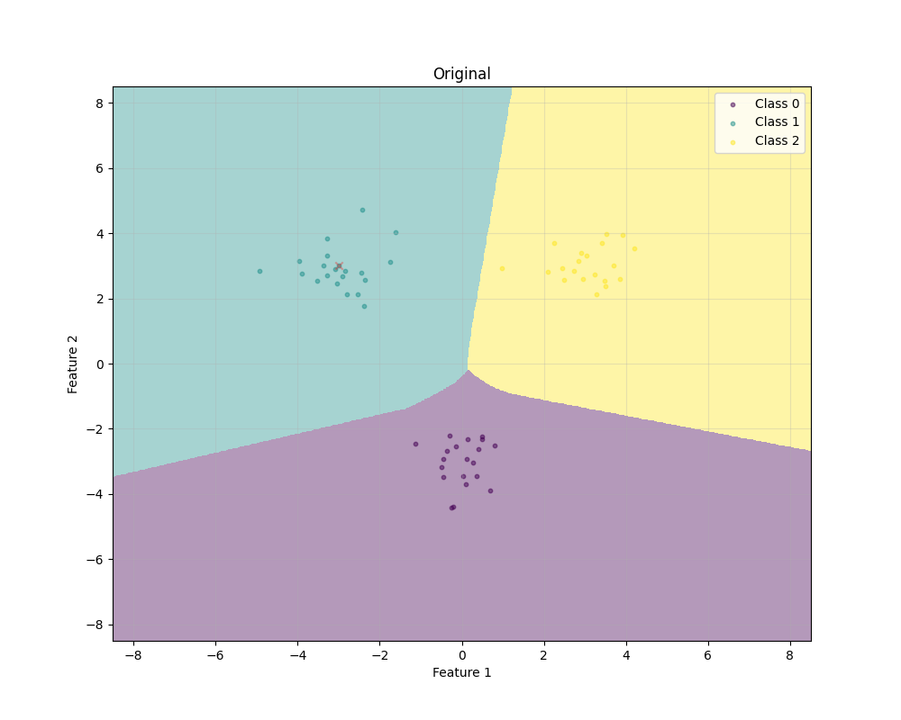</td>
    <td></td>
  </tr>
</table>


### 3. Rogue point with same centroid as the class with a different label
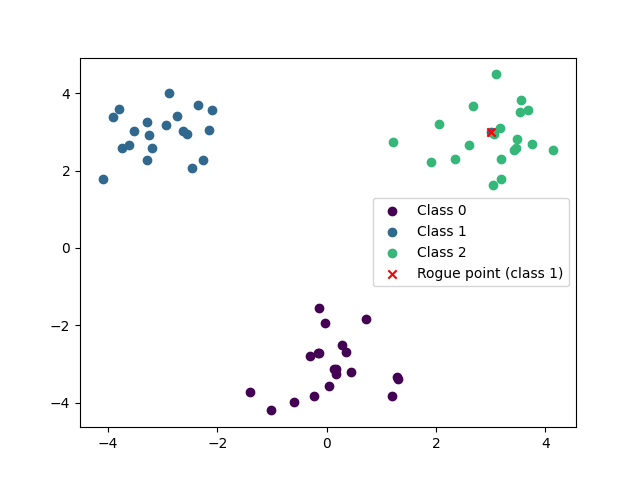

#### Expectation
<!-- TODO: What do we expect -->


#### Run the experiment
<!-- TODO: Command to run experiment -->


#### Findings

<table>
  <tr>
    <th align="center" style="font-weight: bold"></th>
    <th align="center" style="font-weight: bold">Original</th>
    <th align="center" style="font-weight: bold">Unlearned</th>
  </tr>
  <tr>
    <td>Retrain</td>
    <td>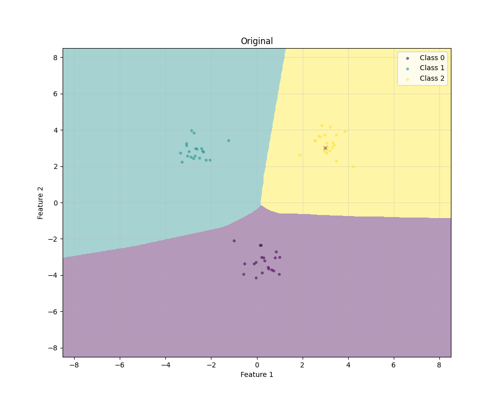</td>
    <td>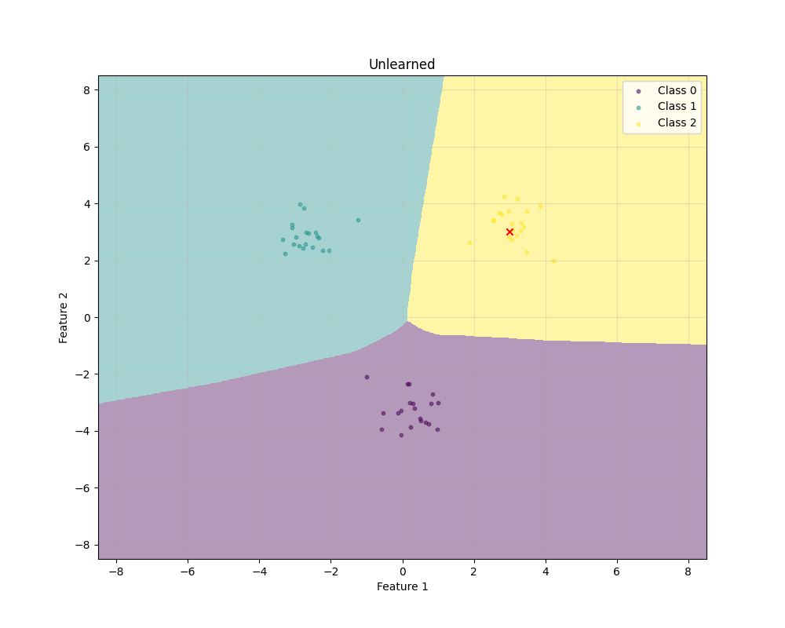</td>
  </tr>
</table>

### 4. Rogue point far away from its centroid, but probably in the same decision boundary
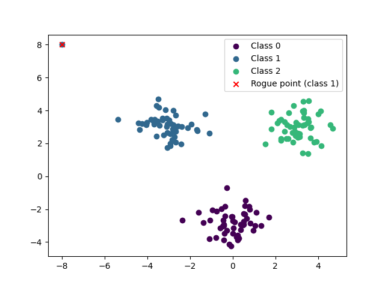

#### Expectation
<!-- TODO: What do we expect -->


#### Run the experiment
<!-- TODO: Command to run experiment -->


#### Findings

<table>
  <tr>
    <th align="center" style="font-weight: bold"></th>
    <th align="center" style="font-weight: bold">Original</th>
    <th align="center" style="font-weight: bold">Unlearned</th>
  </tr>
  <tr>
    <td>Retrain</td>
    <td></td>
    <td>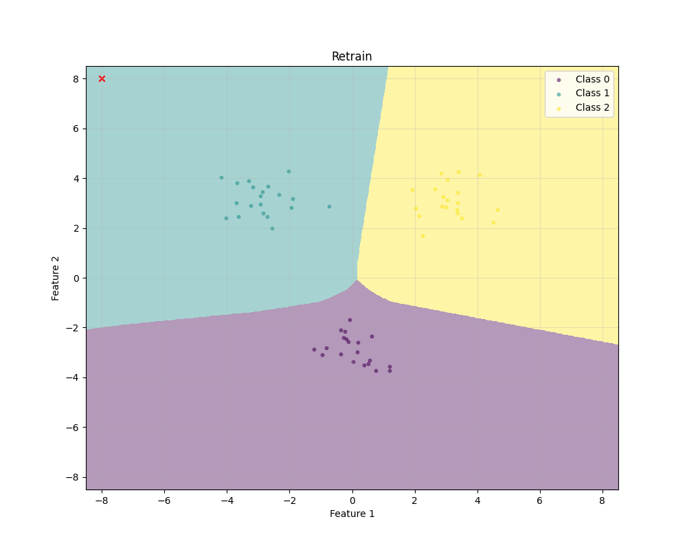</td>
  </tr>
</table>


### 5. Rogue point far away from its centroid, but probably in the same decision boundary
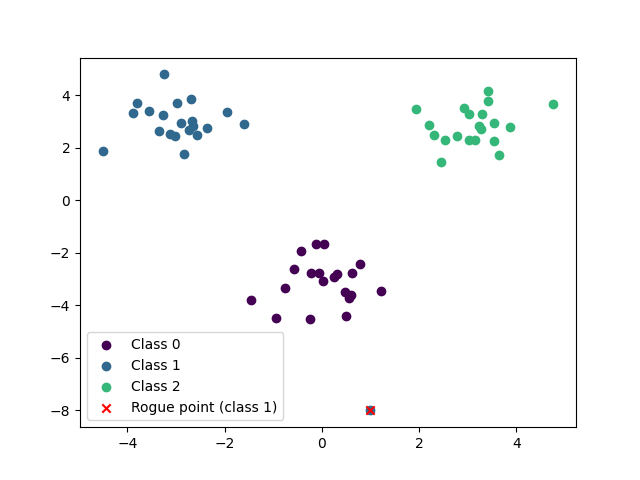

#### Expectation
<!-- TODO: What do we expect -->


#### Run the experiment
<!-- TODO: Command to run experiment -->


#### Findings

<table>
  <tr>
    <th align="center" style="font-weight: bold"></th>
    <th align="center" style="font-weight: bold">Original</th>
    <th align="center" style="font-weight: bold">Unlearned</th>
  </tr>
  <tr>
    <td>Retrain</td>
    <td>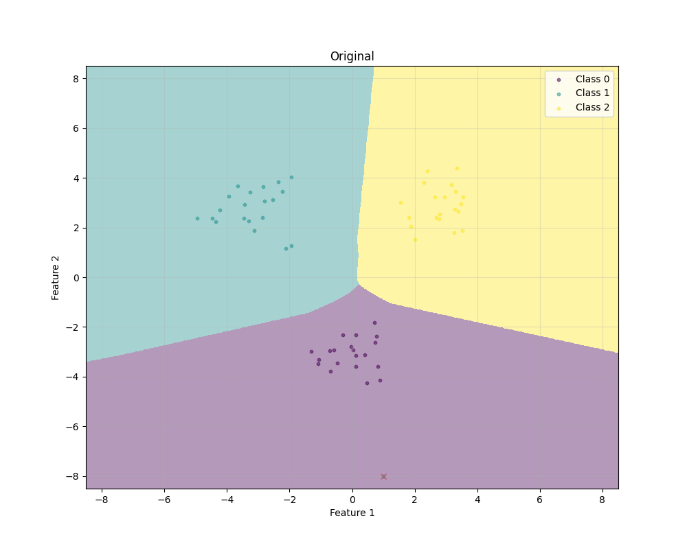</td>
    <td></td>
  </tr>
</table>